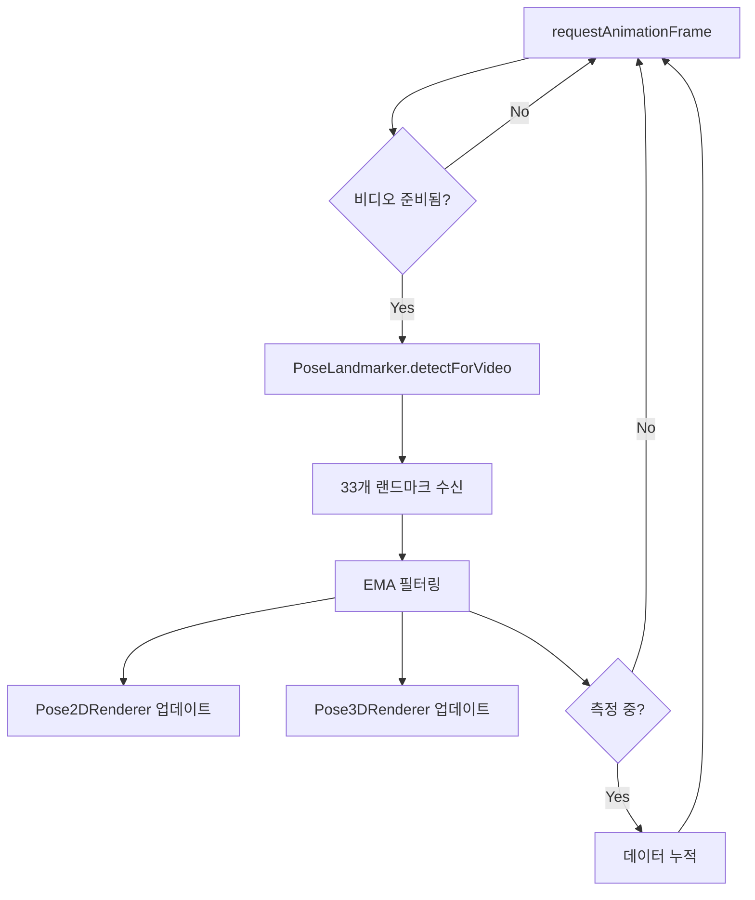

# JaneJase Frontend - 기능 흐름도 및 아키텍처 문서

> 작성일: 2026-01-08
>
> JaneJase 프론트엔드의 전체 아키텍처, 기능 흐름, 그리고 주요 컴포넌트에 대한 상세 문서입니다.

---

## 📋 목차

1. [개요](#개요)
2. [주요 라우팅 구조](#주요-라우팅-구조)
3. [핵심 사용자 플로우](#핵심-사용자-플로우)
4. [아키텍처 구성](#아키텍처-구성)
5. [주요 컴포넌트](#주요-컴포넌트)
6. [AI/ML 처리 파이프라인](#aiml-처리-파이프라인)
7. [데이터 흐름](#데이터-흐름)
8. [기술 스택](#기술-스택)
9. [프로젝트 구조](#프로젝트-구조)
10. [구현 세부사항](#구현-세부사항)

---

## 개요

JaneJase Frontend는 **AI 기반 실시간 자세 교정 서비스**를 제공하는 React 애플리케이션입니다. MediaPipe를 활용한 포즈 감지, Zustand 기반 상태 관리, Tailwind CSS를 이용한 반응형 디자인으로 구성되어 있습니다.

**핵심 가치:**

- 실시간 포즈 감지 및 자세 분석
- 개인 맞춤형 기준 자세 설정
- GPU 가속 ML 추론
- 간결하고 직관적인 사용자 경험

---

## 주요 라우팅 구조

애플리케이션은 React Router v7을 사용하며 다음과 같은 라우트 구조를 가집니다:

```
/ (HomePage)
├─ /login (LoginPage)
├─ /auth/callback (CallbackPage)
├─ /pose/init (PoseWebcamPage)
├─ /pose/dashboard (DashboardPage)
└─ /* (NotFoundPage - catch-all)
```

### 라우트 상세

| 경로              | 컴포넌트       | 설명                               | 인증 필요 |
| ----------------- | -------------- | ---------------------------------- | --------- |
| `/`               | HomePage       | 랜딩 페이지, 히어로 섹션, CTA 버튼 | ❌        |
| `/login`          | LoginPage      | OAuth 인증 (Google/Kakao)          | ❌        |
| `/auth/callback`  | CallbackPage   | OAuth 리디렉션 처리, 토큰 추출     | ❌        |
| `/pose/init`      | PoseWebcamPage | 웹캠 설정 및 10초 기준 측정        | ⚠️ (권장) |
| `/pose/dashboard` | DashboardPage  | 실시간 자세 모니터링 대시보드      | ⚠️ (권장) |
| `/*`              | NotFoundPage   | 404 페이지                         | ❌        |

---

## 핵심 사용자 플로우

### 1️⃣ 인증 플로우

```mermaid
graph TD
    A[홈페이지 - 비로그인] -->|자세 교정하러 가기 클릭| B[로그인 페이지]
    B -->|Google/Kakao 선택| C[백엔드 OAuth 리디렉션]
    C -->|인증 완료| D[/auth/callback?token=xyz]
    D -->|토큰 저장 & 유저 정보 조회| E[홈페이지 - 로그인 완료]
```

**단계별 동작:**

1. **홈페이지 진입** - 비로그인 상태
2. **"자세 교정하러 가기" 클릭** → `/login` 리디렉션
3. **OAuth 제공자 선택** (Google/Kakao)
4. **백엔드 OAuth 엔드포인트 호출** → `/auth/login/google`
5. **Google 인증 완료** → 백엔드가 `/auth/callback?token=xyz`로 리디렉션
6. **CallbackPage에서 토큰 추출** → `setToken()` 호출
7. **유저 정보 조회** → `fetchUser()` → `GET /auth/me`
8. **홈페이지로 복귀** - 로그인 완료, 헤더에 유저 프로필 표시

---

### 2️⃣ 자세 측정 플로우

```mermaid
graph TD
    A[홈페이지 - 로그인 상태] -->|자세 교정하러 가기 클릭| B[/pose/init - 웹캠 초기화]
    B -->|웹캠 시작| C[바른 자세로 10초 측정]
    C -->|33개 포즈 랜드마크 수집| D[평균값 계산]
    D -->|다음 단계로 이동 클릭| E[/pose/dashboard]
    E -->|지속적인 자세 분석| F[실시간 메트릭 표시]
```

**단계별 동작:**

1. **홈페이지에서 "자세 교정하러 가기" 클릭** → `/pose/init` 이동
2. **웹캠 권한 요청 및 시작**
3. **사용자가 바른 자세로 앉음**
4. **"측정 시작" 버튼 클릭** → 10초 카운트다운 시작
5. **10초 동안 포즈 랜드마크 수집** (33개 포인트 × 100프레임)
6. **평균값 계산** → 개인 맞춤 기준 자세 데이터 생성
7. **"다음 단계로 이동" 클릭** → `/pose/dashboard`로 state 전달
8. **대시보드에서 실시간 모니터링 시작**
   - 현재 자세 vs 기준 자세 비교
   - 목 각도, 어깨 수평, 화면 거리 분석
   - 경고 및 통계 표시

---

## 아키텍처 구성

### 상태 관리 (Zustand)

#### `useAuthStore` (인증 스토어)

```typescript
interface AuthStore {
  user: User | null; // { id, email, name, picture? }
  token: string | null; // localStorage에 저장
  isAuthenticated: boolean; // token 존재 여부에서 파생
  isLoading: boolean;

  // Actions
  gLogin: () => void; // 백엔드 OAuth로 리디렉션
  gLogout: () => void; // 토큰 & 유저 정보 제거
  setToken: (token: string) => void; // 토큰 저장
  fetchUser: () => Promise<void>; // GET /auth/me 호출
}
```

**주요 기능:**

- OAuth 인증 상태 관리
- 토큰 localStorage 영속화
- 유저 프로필 조회 및 캐싱
- 로그아웃 시 상태 초기화

---

#### `useHealthStore` (헬스 체크 스토어)

```typescript
interface HealthStore {
  healthStatus: 'idle' | 'loading' | 'success' | 'error';
  healthMessage: string;

  // Actions
  checkServerHealth: () => Promise<void>; // GET /health 호출
}
```

**주요 기능:**

- 백엔드 서버 연결 상태 확인
- 홈페이지 모달에서 헬스 체크 버튼으로 호출

---

### API 통신

**Base URL:** `http://localhost:8010` (환경변수 `VITE_API_BASE_URL`로 설정 가능)

#### 주요 엔드포인트

| 메서드 | 경로                 | 설명                  | 인증 필요 |
| ------ | -------------------- | --------------------- | --------- |
| `GET`  | `/health`            | 서버 상태 확인        | ❌        |
| `GET`  | `/auth/me`           | 사용자 프로필 조회    | ✅        |
| `POST` | `/auth/login/google` | Google OAuth 리디렉션 | ❌        |

**HTTP 클라이언트:** Native `fetch` API (Axios는 설치되어 있으나 미사용)

**인증 헤더 형식:**

```typescript
Authorization: Bearer<token>;
```

---

## 주요 컴포넌트

### 페이지 컴포넌트

#### `HomePage` (`src/pages/Home/HomePage.tsx`)

**기능:**

- 히어로 섹션 및 CTA 버튼
- 헬스 체크 모달 (서버 상태 확인)
- 포즈 감지 데모 이미지 표시
- 로그인 상태에 따른 조건부 렌더링

**주요 요소:**

```tsx
{
  /* CTA Buttons */
}
<Button onClick={() => navigate('/pose/init')}>자세 교정하러 가기</Button>;

{
  /* Health Check Modal */
}
<Modal isOpen={isModalOpen}>
  <Button onClick={checkServerHealth}>서버 상태 확인</Button>
</Modal>;

{
  /* Demo Image */
}
;
```

---

#### `LoginPage` (`src/pages/Auth/LoginPage.tsx`)

**기능:**

- Google/Kakao OAuth 로그인 버튼
- 백엔드 OAuth 엔드포인트로 리디렉션

**동작:**

```typescript
const handleGoogleLogin = () => {
  gLogin(); // useAuthStore의 gLogin 호출
  // → window.location.href = `${API_BASE_URL}/auth/login/google`
};
```

---

#### `CallbackPage` (`src/pages/Auth/CallbackPage.tsx`)

**기능:**

- URL에서 토큰 추출 (`?token=xyz`)
- 토큰 저장 및 유저 정보 조회
- 로딩 스피너 표시

**동작:**

```typescript
useEffect(() => {
  const token = new URLSearchParams(location.search).get('token');
  if (token) {
    setToken(token);
    fetchUser().then(() => navigate('/'));
  }
}, []);
```

---

#### `PoseWebcamPage` (`src/pages/Pose/Init/PoseWebcamPage.tsx`)

**기능:**

- 웹캠 시작/중지 제어
- 10초 측정 타이머
- 2D 포즈 오버레이 렌더링
- 3D 포즈 시각화 (개발자 모드)
- 측정 완료 시 성공 패널 표시

**주요 상태:**

```typescript
const [isWebcamStarted, setIsWebcamStarted] = useState(false);
const [isMeasuring, setIsMeasuring] = useState(false);
const [measurementProgress, setMeasurementProgress] = useState(0);
const [measurementComplete, setMeasurementComplete] = useState(false);
const measurementDataRef = useRef<NormalizedLandmark[][]>([]);
```

**측정 로직:**

```typescript
// 10초 동안 100프레임 수집
if (isMeasuring) {
  measurementDataRef.current.push(landmarks);
  if (measurementDataRef.current.length >= 100) {
    const avgData = calculateAverage(measurementDataRef.current);
    setMeasurementComplete(true);
  }
}
```

---

#### `DashboardPage` (`src/pages/Pose/Dashboard/DashboardPage.tsx`)

**기능:**

- 실시간 웹캠 피드
- 현재 자세 상태 카드 (목 각도, 어깨 수평, 화면 거리)
- 오늘의 통계 (경고 횟수, 집중 시간)
- 스트레칭 리마인더
- 주요 메트릭 그리드
- 3D 포즈 렌더러 (개발자 모드)

**레이아웃:**

```tsx
<div className="grid grid-cols-1 lg:grid-cols-3 gap-6">
  <div className="lg:col-span-2">
    <VideoFeedSection />
    <CurrentStatusCard />
  </div>
  <div className="space-y-6">
    <TodayStatsCard />
    <MetricsCard />
    <StretchingReminderCard />
  </div>
</div>
```

**측정 데이터 수신:**

```typescript
const location = useLocation();
const measurementData = location.state?.measurementData;
// PoseWebcamPage에서 전달된 기준 자세 데이터
```

---

### 대시보드 하위 컴포넌트

#### `CurrentStatusCard`

- 현재 자세 상태 표시 (Good/Warning/Bad)
- 목 각도, 어깨 수평도, 화면 거리 메트릭

#### `TodayStatsCard`

- 오늘의 나쁜 자세 경고 횟수
- 총 집중 시간

#### `MetricsCard`

- 머리 기울기, 몸 기울기, 화면 거리 등 주요 메트릭 그리드

#### `VideoFeedSection`

- 실시간 웹캠 피드
- 시작/중지 컨트롤

#### `StretchingReminderCard`

- 거북목 예방을 위한 스트레칭 팁

---

### 공통 컴포넌트

#### `Button` (`src/components/common/Button`)

**Variants:**

- `primary` - 주요 액션 (파란색)
- `secondary` - 보조 액션 (회색)
- `accent` - 강조 (보라색)
- `success` - 성공 (초록색)
- `ghost` - 투명 배경
- `outline` - 테두리만

**Sizes:**

- `sm` - 작은 버튼
- `md` - 중간 버튼 (기본)
- `lg` - 큰 버튼

---

#### `Modal` (`src/components/common/Modal`)

**Props:**

```typescript
interface ModalProps {
  isOpen: boolean;
  onClose: () => void;
  title?: string;
  children: ReactNode;
}
```

---

#### `Pose2DRenderer` (`src/pages/Pose/Pose2DRenderer.tsx`)

**기능:**

- Canvas 기반 2D 포즈 스켈레톤 렌더링
- 33개 랜드마크 포인트 + 연결선
- EMA 스무딩 (alpha=0.25)
- 비디오 크기에 맞춰 반응형 캔버스

**렌더링 로직:**

```typescript
// 랜드마크 포인트 그리기
landmarks.forEach(lm => {
  ctx.beginPath();
  ctx.arc(lm.x * width, lm.y * height, 5, 0, 2 * Math.PI);
  ctx.fill();
});

// 연결선 그리기 (어깨-어깨, 팔꿈치-손목 등)
POSE_CONNECTIONS.forEach(([start, end]) => {
  ctx.moveTo(landmarks[start].x * width, landmarks[start].y * height);
  ctx.lineTo(landmarks[end].x * width, landmarks[end].y * height);
  ctx.stroke();
});
```

---

#### `Pose3DRenderer` (`src/pages/Pose/Pose3DRenderer.tsx`)

**기능:**

- Three.js 기반 3D 포즈 시각화
- 어깨 중심 기준 월드 좌표계
- 포인트 + 연결선 렌더링
- 축 헬퍼 포함
- EMA 스무딩 (alpha=0.2)
- ResizeObserver로 반응형 처리

**Three.js 씬 구성:**

```typescript
const scene = new THREE.Scene();
const camera = new THREE.PerspectiveCamera(75, aspect, 0.1, 1000);
const renderer = new THREE.WebGLRenderer({ antialias: true });

// 랜드마크 포인트 (SphereGeometry)
const pointMesh = new THREE.Mesh(
  new THREE.SphereGeometry(0.02, 16, 16),
  new THREE.MeshBasicMaterial({ color: 0x00ff00 })
);

// 연결선 (LineSegments)
const lineMesh = new THREE.LineSegments(
  new THREE.BufferGeometry(),
  new THREE.LineBasicMaterial({ color: 0xffffff })
);
```

---

## AI/ML 처리 파이프라인

### MediaPipe 포즈 감지

**모델:** MediaPipe PoseLandmarker (33포인트 신체 랜드마크)

**처리 루프:**



**코드 예시:**

```typescript
const detectPose = async () => {
  if (!poseLandmarker || !videoRef.current) return;

  const video = videoRef.current;
  if (video.readyState < 2) {
    requestAnimationFrame(detectPose);
    return;
  }

  const timestamp = video.currentTime * 1000;

  poseLandmarker.detectForVideo(video, timestamp, result => {
    if (result.landmarks && result.landmarks.length > 0) {
      const landmarks = result.landmarks[0]; // 2D normalized landmarks
      const worldLandmarks = result.worldLandmarks?.[0]; // 3D world coordinates

      // EMA 스무딩
      const smoothedLandmarks = applyEMA(landmarks, previousLandmarks, 0.25);

      // 렌더링
      updatePose2D(smoothedLandmarks);
      updatePose3D(worldLandmarks);

      // 측정 중이면 데이터 누적
      if (isMeasuring) {
        measurementDataRef.current.push(smoothedLandmarks);
      }
    }
  });

  requestAnimationFrame(detectPose);
};
```

---

### EMA (Exponential Moving Average) 스무딩

**목적:** 포즈 감지의 떨림(jitter) 제거

**공식:**

```
smoothed_value = alpha * new_value + (1 - alpha) * previous_value
```

**파라미터:**

- 2D 렌더러: `alpha = 0.25` (빠른 반응)
- 3D 렌더러: `alpha = 0.2` (부드러운 움직임)

**구현:**

```typescript
function applyEMA(
  current: NormalizedLandmark[],
  previous: NormalizedLandmark[] | null,
  alpha: number
): NormalizedLandmark[] {
  if (!previous) return current;

  return current.map((lm, i) => ({
    x: alpha * lm.x + (1 - alpha) * previous[i].x,
    y: alpha * lm.y + (1 - alpha) * previous[i].y,
    z: alpha * lm.z + (1 - alpha) * previous[i].z,
    visibility: lm.visibility,
  }));
}
```

---

### 측정 데이터 평균 계산

**과정:**

1. 10초 동안 100프레임 수집 (~10fps)
2. 각 랜드마크별로 x, y, z 좌표 평균
3. 결과를 기준 자세 데이터로 저장

**구현:**

```typescript
function calculateAverage(
  dataArray: NormalizedLandmark[][]
): NormalizedLandmark[] {
  const numFrames = dataArray.length;
  const numLandmarks = dataArray[0].length;

  return Array.from({ length: numLandmarks }, (_, i) => {
    const sum = dataArray.reduce(
      (acc, frame) => ({
        x: acc.x + frame[i].x,
        y: acc.y + frame[i].y,
        z: acc.z + frame[i].z,
      }),
      { x: 0, y: 0, z: 0 }
    );

    return {
      x: sum.x / numFrames,
      y: sum.y / numFrames,
      z: sum.z / numFrames,
      visibility: 1,
    };
  });
}
```

---

## 데이터 흐름

### 측정 데이터 전달

```typescript
// PoseWebcamPage.tsx
const handleNextStep = () => {
  const avgData = calculateAverage(measurementDataRef.current);
  navigate('/pose/dashboard', {
    state: { measurementData: avgData },
  });
};

// DashboardPage.tsx
const location = useLocation();
const baselineMeasurement = location.state?.measurementData;
// 기준 자세 데이터를 실시간 비교에 사용
```

---

### 인증 토큰 관리

```typescript
// CallbackPage.tsx - 토큰 추출
const token = new URLSearchParams(location.search).get('token');
if (token) {
  setToken(token); // localStorage에 저장
  fetchUser(); // GET /auth/me 호출
}

// useAuthStore.ts - 토큰 저장
const setToken = (token: string) => {
  localStorage.setItem('token', token);
  set({ token, isAuthenticated: true });
};

// API 요청 시 - 헤더에 포함
const headers = {
  Authorization: `Bearer ${token}`,
  'Content-Type': 'application/json',
};
```

---

### WebCam Stream 관리

```typescript
// 웹캠 시작
const startWebcam = async () => {
  try {
    const stream = await navigator.mediaDevices.getUserMedia({
      video: { width: 1280, height: 720 },
    });

    if (videoRef.current) {
      videoRef.current.srcObject = stream;
      setIsWebcamStarted(true);
      detectPose(); // 포즈 감지 루프 시작
    }
  } catch (error) {
    console.error('Webcam access denied:', error);
  }
};

// 웹캠 중지 (컴포넌트 언마운트 시)
useEffect(() => {
  return () => {
    const stream = videoRef.current?.srcObject as MediaStream;
    stream?.getTracks().forEach(track => track.stop());
  };
}, []);
```

---

## 기술 스택

### 프론트엔드 프레임워크

| 항목          | 기술             | 버전 |
| ------------- | ---------------- | ---- |
| **런타임**    | React            | 19.2 |
| **언어**      | TypeScript       | 5.9  |
| **빌드 도구** | Vite             | 7.2  |
| **라우팅**    | React Router DOM | 7.11 |

### 상태 관리 & 데이터 페칭

| 항목                | 기술        | 버전   |
| ------------------- | ----------- | ------ |
| **상태 관리**       | Zustand     | 5.0    |
| **데이터 페칭**     | React Query | 5.90   |
| **HTTP 클라이언트** | Fetch API   | Native |

### AI/ML & 그래픽스

| 항목          | 기술                   | 버전   |
| ------------- | ---------------------- | ------ |
| **포즈 감지** | MediaPipe Tasks Vision | 0.10   |
| **3D 렌더링** | Three.js               | 0.182  |
| **WebGL**     | -                      | Native |

### 스타일링 & UI

| 항목               | 기술         | 버전 |
| ------------------ | ------------ | ---- |
| **CSS 프레임워크** | Tailwind CSS | 3.4  |
| **PostCSS**        | PostCSS      | 8.5  |
| **Autoprefixer**   | Autoprefixer | 10.4 |

### 코드 품질

| 항목          | 기술       | 버전 |
| ------------- | ---------- | ---- |
| **린터**      | ESLint     | 9.39 |
| **포매터**    | Prettier   | 3.7  |
| **타입 체크** | TypeScript | 5.9  |

---

## 프로젝트 구조

```
JaneJase_FRONTEND/
├── src/
│   ├── app/                    # 앱 설정 및 프로바이더
│   │   ├── App.tsx            # 루트 컴포넌트 (헤더, 테마 토글, 인증 UI)
│   │   ├── main.tsx           # React DOM 렌더링 엔트리포인트
│   │   ├── routes.tsx         # 라우트 정의
│   │   └── providers/
│   │       ├── QueryProvider.tsx  # React Query 설정
│   │       └── ThemeProvider.tsx  # 다크 모드 테마 토글
│   │
│   ├── pages/                 # 페이지 컴포넌트
│   │   ├── Auth/
│   │   │   ├── LoginPage.tsx       # OAuth 로그인 버튼
│   │   │   └── CallbackPage.tsx    # 토큰 처리 & 로딩
│   │   ├── Home/
│   │   │   └── HomePage.tsx        # 랜딩 페이지
│   │   ├── NotFound/
│   │   │   └── NotFoundPage.tsx    # 404 페이지
│   │   └── Pose/
│   │       ├── Init/
│   │       │   └── PoseWebcamPage.tsx  # 10초 측정
│   │       ├── Dashboard/
│   │       │   ├── DashboardPage.tsx   # 실시간 모니터링
│   │       │   └── components/
│   │       │       ├── CurrentStatusCard.tsx
│   │       │       ├── VideoFeedSection.tsx
│   │       │       ├── TodayStatsCard.tsx
│   │       │       ├── MetricsCard.tsx
│   │       │       └── StretchingReminderCard.tsx
│   │       ├── Pose2DRenderer.tsx  # Canvas 2D 포즈
│   │       └── Pose3DRenderer.tsx  # Three.js 3D 포즈
│   │
│   ├── components/            # 공통 컴포넌트
│   │   └── common/
│   │       ├── Button/
│   │       │   ├── Button.tsx
│   │       │   └── index.ts
│   │       ├── Modal/
│   │       │   ├── Modal.tsx
│   │       │   └── index.ts
│   │       └── ProtectedRoute.tsx
│   │
│   ├── stores/                # Zustand 상태 관리
│   │   ├── useAuthStore.ts    # 인증 스토어
│   │   └── useHealthStore.ts  # 헬스 체크 스토어
│   │
│   ├── types/                 # TypeScript 타입 정의
│   │   ├── poseTypes.ts       # 포즈 관련 타입
│   │   └── env.d.ts           # 환경변수 타입
│   │
│   ├── utils/                 # 유틸리티 함수
│   │   └── format.ts          # 포맷팅 함수
│   │
│   └── styles/                # 전역 스타일
│       └── globals.css        # Tailwind imports + 커스텀 스타일
│
├── public/                    # 정적 파일
│   └── vite.svg
│
├── index.html                 # HTML 엔트리포인트
├── vite.config.ts             # Vite 설정
├── tailwind.config.js         # Tailwind CSS 설정
├── tsconfig.json              # TypeScript 설정
├── tsconfig.app.json          # 앱용 TS 설정
├── tsconfig.node.json         # Node용 TS 설정
├── eslint.config.js           # ESLint 설정
├── .prettierrc                # Prettier 설정
├── package.json               # 의존성 관리
└── README.md                  # 프로젝트 문서
```

---

## 구현 세부사항

### 1. 반응형 Canvas 렌더링

**문제:** Canvas 크기가 비디오 크기와 일치해야 정확한 좌표 매핑 가능

**해결:**

```typescript
// Pose2DRenderer.tsx
useEffect(() => {
  if (videoRef.current && canvasRef.current) {
    const video = videoRef.current;
    const canvas = canvasRef.current;

    // 비디오 크기에 맞춰 캔버스 크기 설정
    canvas.width = video.videoWidth;
    canvas.height = video.videoHeight;
  }
}, [videoRef.current?.videoWidth]);
```

---

### 2. Three.js 반응형 처리

**문제:** 컨테이너 크기 변경 시 3D 씬 크기도 업데이트 필요

**해결:**

```typescript
// Pose3DRenderer.tsx
useEffect(() => {
  const resizeObserver = new ResizeObserver(entries => {
    const { width, height } = entries[0].contentRect;

    camera.aspect = width / height;
    camera.updateProjectionMatrix();
    renderer.setSize(width, height);
  });

  resizeObserver.observe(containerRef.current);

  return () => resizeObserver.disconnect();
}, []);
```

---

### 3. 비동기 모델 로딩

**문제:** MediaPipe 모델은 CDN에서 로드되므로 비동기 처리 필요

**해결:**

```typescript
useEffect(() => {
  const loadModel = async () => {
    const vision = await FilesetResolver.forVisionTasks(
      'https://cdn.jsdelivr.net/npm/@mediapipe/tasks-vision@0.10.0/wasm'
    );

    const landmarker = await PoseLandmarker.createFromOptions(vision, {
      baseOptions: {
        modelAssetPath:
          'https://storage.googleapis.com/mediapipe-models/pose_landmarker/pose_landmarker_lite/float16/1/pose_landmarker_lite.task',
        delegate: 'GPU', // GPU 가속
      },
      runningMode: 'VIDEO',
      numPoses: 1,
    });

    setPoseLandmarker(landmarker);
  };

  loadModel();
}, []);
```

---

### 4. 측정 타이머 구현

**요구사항:** 10초 동안 포즈 데이터 수집, 진행률 표시

**해결:**

```typescript
useEffect(() => {
  if (!isMeasuring) return;

  const startTime = Date.now();
  const interval = setInterval(() => {
    const elapsed = Date.now() - startTime;
    const progress = Math.min((elapsed / 10000) * 100, 100);

    setMeasurementProgress(progress);

    if (progress >= 100) {
      clearInterval(interval);
      setIsMeasuring(false);
      setMeasurementComplete(true);
    }
  }, 100);

  return () => clearInterval(interval);
}, [isMeasuring]);
```

---

### 5. 안전한 스트림 정리

**문제:** 컴포넌트 언마운트 시 웹캠 스트림 해제 필요

**해결:**

```typescript
useEffect(() => {
  return () => {
    // RAF 취소
    if (rafIdRef.current) {
      cancelAnimationFrame(rafIdRef.current);
    }

    // 미디어 스트림 해제
    const stream = videoRef.current?.srcObject as MediaStream;
    stream?.getTracks().forEach(track => track.stop());

    // MediaPipe 모델 정리
    poseLandmarker?.close();
  };
}, []);
```

---

### 6. 개발자 모드 토글

**목적:** 3D 포즈 시각화는 디버깅용이므로 기본적으로 숨김

**구현:**

```typescript
// 숨겨진 버튼 (개발자만 알 수 있도록)
<button
  onClick={() => setShowDeveloperMode(!showDeveloperMode)}
  className="absolute top-2 right-2 opacity-0 hover:opacity-100"
>
  Dev
</button>

{showDeveloperMode && <Pose3DRenderer worldLandmarks={worldLandmarks} />}
```

---

### 7. 로컬스토리지 토큰 영속화

**목적:** 페이지 새로고침 시에도 로그인 유지

**구현:**

```typescript
// useAuthStore.ts
const useAuthStore = create<AuthStore>(set => ({
  token: localStorage.getItem('token'),
  isAuthenticated: !!localStorage.getItem('token'),

  setToken: token => {
    localStorage.setItem('token', token);
    set({ token, isAuthenticated: true });
  },

  gLogout: () => {
    localStorage.removeItem('token');
    set({ token: null, user: null, isAuthenticated: false });
  },
}));
```

---

## 향후 개선 방향

### 기능 개선

- [ ] 실시간 자세 경고 알림 (브라우저 Notification API)
- [ ] 자세 히스토리 차트 (Chart.js 또는 Recharts)
- [ ] 스트레칭 타이머 및 리마인더
- [ ] 다중 프로필 지원 (가족 구성원별 기준 자세)
- [ ] 포즈 데이터 내보내기 (CSV/JSON)

### 성능 최적화

- [ ] 포즈 감지 프레임레이트 조절 (배터리 절약)
- [ ] Web Worker로 ML 추론 오프로드
- [ ] Canvas 오프스크린 렌더링
- [ ] 이미지 최적화 (WebP, lazy loading)

### UX 개선

- [ ] 온보딩 튜토리얼
- [ ] 자세 교정 가이드 애니메이션
- [ ] 다국어 지원 (i18n)
- [ ] 접근성 개선 (ARIA 레이블, 키보드 네비게이션)

### 기술 부채 해결

- [ ] 타입 안전성 강화 (any 타입 제거)
- [ ] 에러 바운더리 추가
- [ ] 유닛 테스트 작성 (Vitest)
- [ ] E2E 테스트 (Playwright)
- [ ] Storybook 컴포넌트 문서화

---

## 참고 자료

- [MediaPipe Pose Landmark Detection](https://developers.google.com/mediapipe/solutions/vision/pose_landmarker)
- [React Router v7 Documentation](https://reactrouter.com/)
- [Zustand Documentation](https://docs.pmnd.rs/zustand/getting-started/introduction)
- [Three.js Documentation](https://threejs.org/docs/)
- [Tailwind CSS Documentation](https://tailwindcss.com/docs)

---

**Last Updated:** 2026-01-08
**Document Version:** 1.0.0
**Maintained by:** JaneJase Team
